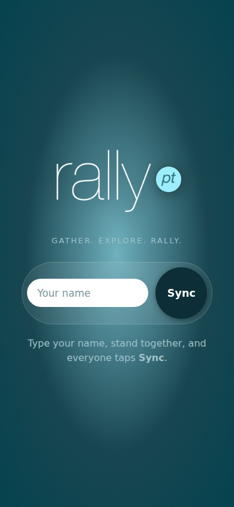
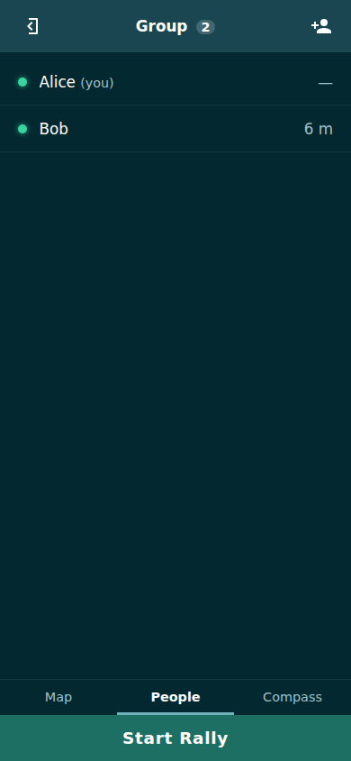
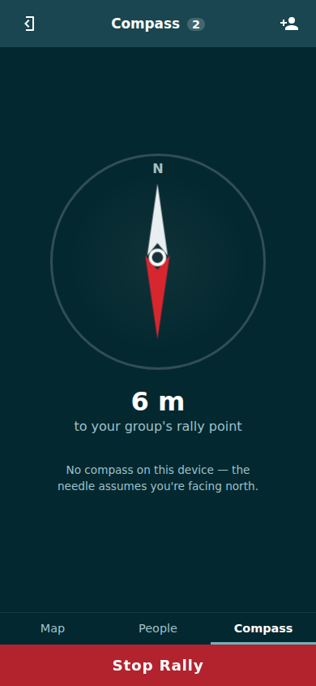
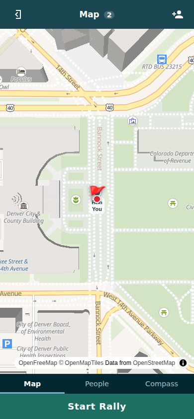

# RallyPoint

**Gather. Explore. Rally.**

Keep your group together in crowded places. Stand next to your friends, everyone
taps **Sync**, and you're a group — no accounts, no friend requests, no QR codes.
From then on you see each other live on a map, with distances and a compass that
always points at your group's rally point. Someone hits **Start Rally** and every
member gets a push notification and a needle to follow until you've all converged.

**Live at [rallypoint.markvanaken.com](https://rallypoint.markvanaken.com)**
(backup: [rallypoint.mark-vanaken.workers.dev](https://rallypoint.mark-vanaken.workers.dev)).
Install it from the browser menu ("Add to Home Screen") for the full experience,
including push notifications on iOS.

| Home | Group | Rally | Map |
| --- | --- | --- | --- |
|  |  |  |  |

This is a ground-up 2026 rebuild of the 2015 Meteor/Cordova hackathon app of the
same name (its source lives in this repo's git history before this rewrite).

## How it works

1. **Anonymous identity** — first visit mints a random user id in a signed,
   httpOnly cookie. The only thing you ever type is your first name.
2. **Proximity sync** — while you hold "Sync", your phone streams GPS fixes
   over a WebSocket to a matchmaker (a Durable Object). When two or more
   syncing users stay within ~50 m of each other (widened by GPS accuracy,
   capped) for 2 seconds, the server atomically forms a group and tells
   everyone. No client-side leader election, no races.
3. **Live group room** — each group is its own Durable Object holding
   membership + rally state in its private SQLite database, fanning member
   positions out over hibernating WebSockets. Positions live in memory only:
   they are never persisted (privacy + free-tier row budget) and evaporate
   when the group dissolves.
4. **Rally point** — the centroid of all member positions, computed
   client-side as a pure function of positions every client already has.
   The map flags it; the compass points at it.
5. **Rally** — flips group state, broadcasts to connected members, and sends
   Web Push (VAPID) to offline members. Tapping the notification deep-links
   into the group. While rallying, the screen stays awake (Wake Lock) and the
   compass takes over.

## Architecture

```
 PWA (Svelte 5 runes, MapLibre GL, OpenFreeMap tiles)
   │  one WebSocket (cookie-authed, JSON frames, zod-validated)
   ▼
 Cloudflare Worker (edge router: session mint/verify, WS routing)
   ├── MatchmakerDO   "lobby" — in-memory proximity clustering
   └── GroupDO (×N)   per-group room — SQLite membership/rally state,
                      in-memory positions, WS fan-out, Web Push, 24h TTL
```

- `shared/` — geo math (haversine, bearing, centroid) and the typed wire
  protocol, imported by both client and server.
- `worker/` — the edge worker + both Durable Objects.
- `app/` — the installable PWA (Vite + Svelte 5).
- `tests/` — black-box test harnesses (see below).

2015 → 2026 translations: Cordova → installable PWA; APNs certificates →
Web Push/VAPID; DDP/Mongo live queries → Durable Object rooms over WebSockets;
Blaze/Tracker → Svelte 5 runes; Google Maps → MapLibre GL + OpenFreeMap;
Cordova compass plugin → `deviceorientationabsolute` / `webkitCompassHeading`;
jQuery viewport hacks → `dvh` units and `env(safe-area-inset-*)`.

## Develop

```sh
pnpm install
pnpm vapid                  # one-time: generate VAPID keys
cp worker/.dev.vars.example worker/.dev.vars   # paste VAPID_PRIVATE_KEY in
# put the printed VAPID_PUBLIC_KEY into worker/wrangler.jsonc "vars"
pnpm dev                    # builds the app, serves everything at :8787
```

`pnpm --filter @rallypoint/app dev` runs Vite with HMR (proxying /api and /ws
to wrangler on :8787) if you're iterating on UI.

## Test

```sh
pnpm test                # unit tests (geo, protocol, clustering, auth) + svelte-check
pnpm test:integration    # spawns wrangler dev, simulates 3 phones over real WebSockets
node tests/browser.mjs   # Playwright: 2 headless phones with mocked GPS through the real UI
BASE_URL=https://rallypoint.markvanaken.com node tests/integration.mjs   # against prod
```

## Deploy

```sh
CLOUDFLARE_API_TOKEN=… CLOUDFLARE_ACCOUNT_ID=… pnpm deploy
# first time only:
wrangler secret put AUTH_SECRET        # any long random string
wrangler secret put VAPID_PRIVATE_KEY  # from `pnpm vapid`
```

Deploys to the custom domain `rallypoint.markvanaken.com` and
`rallypoint.mark-vanaken.workers.dev` (see `worker/wrangler.jsonc`).

### Free-tier fit

Everything runs on Cloudflare's free plan: Durable Objects use the SQLite
backend (`new_sqlite_classes`), static assets are unmetered, outgoing WS
messages are free and incoming ones bill 20:1. Positions are deliberately
kept out of storage, so the 100k row-writes/day budget only sees membership
changes. Map tiles come from OpenFreeMap's public instance (no key, no
limits); Web Push is free by design.

## Known limitations

- **No background location on the web.** When a phone locks or the tab is
  backgrounded, that member's position freezes until they return (Wake Lock
  prevents this during an active rally). Wrap with Capacitor if background
  tracking ever becomes a requirement.
- **iOS push requires installing the PWA** to the home screen (iOS 16.4+).
- **iOS compass needs a permission tap** (the "Enable compass" button).
- The matchmaker is a single global Durable Object — correct and plenty for
  hobby scale; shard `lobbyName()` by coarse geographic cell if it ever runs
  hot.
- Push delivery is exercised by unit/protocol tests but end-to-end delivery
  should be sanity-checked on a real phone (tap "Enable rally alerts", lock
  the phone, have someone start a rally).
